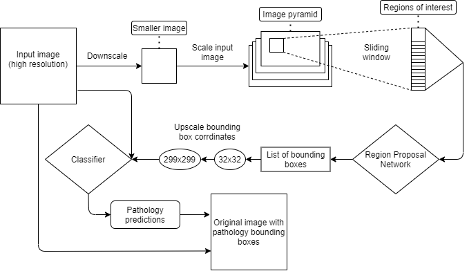
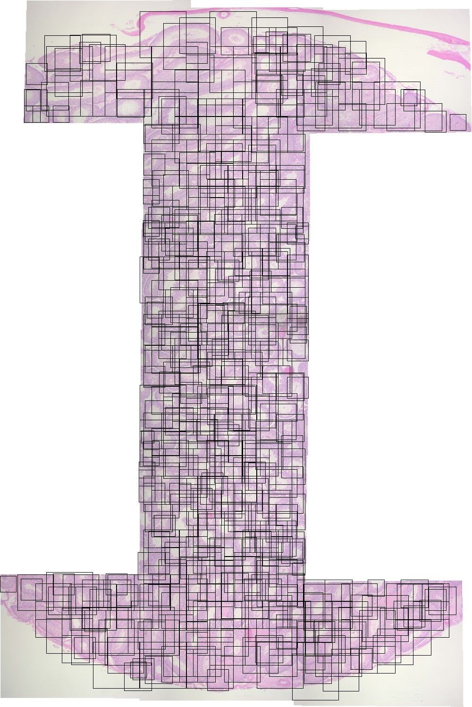
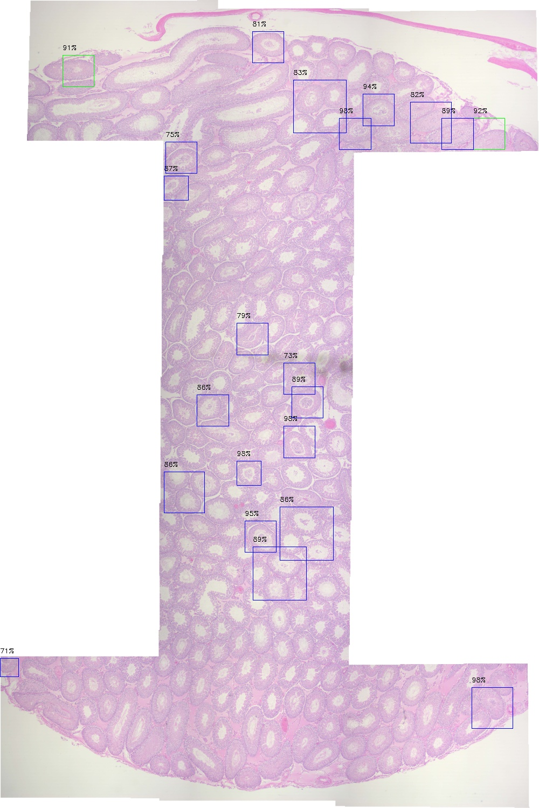

# Digital Pathology

---

### Description of the task

The general goal of this project is to classify images of tissue as either diseased or non-diseased. These images of tissue are composed of numerous cells that are individually diseased or non-diseased. Because of this, being able to classify the entire image is not very useful. 

The approach that I am interested in to work around this problem is called image segmentation. The way this will work is by running an object detection algorithm over the image to put a bounding box around each cell. The segmented cell image will then be fed into a deep neural network classifier that will return a probability representing whether or not the cell is diseased. If this probability passes a certain threshold, the bounding box for that cell will be overlayed on the original image along with the given probability.

---

### Methodology 

This program uses a custom RCNN algorithm to work with high resolution images (roughly 800x12000 pixels). The model is composed of two seperate deep neural networks, a Region Proposal Network (RPN) and a classifier. The first step is to downscale the image (by around a factor of 10) so that RPN can make prediction much faster. The RPN takes 32x32px images given by a sliding window/image pyramid approach and predicts the intersection over union (IOU) of any cell in the image. All regions of interest that exceed a given threshold are then fed to the classifier for pathology prediction. If any pathologies exceed a user defined threshold, then the bounding boxes for those cells will be displayed on the final image.

Diagram illustrating  the model architecture:

---

#### Image with annotation overlayer given by medical professional to show true pathology locations. Input images for this model do not include annotations.

#### RPN output given the input image with no annotations, each bounding box region is fed to the classifier after non-maximum suppression.

#### Classifier bounding box overlay on original input image. Each color represents the respective pathology classified. The percentages represent the classifier's confidence.

---

### Installation and Running Instructions

This program was written in Python 3.
Anaconda is recommended for GPU usage which leads to much faster inference time.
The following modules are required for this program to run and can be installed using pip:

* Tensorflow
* imutils
* numpy
* sklearn
* opencv
* xmltodict
* json

If all modules are installed, you can either clone or download this repository.
Using the terminal, go into the folder that you downloaded or cloned.

Type "python ./R-CNN.py -t \<type> -p \<path>"
The "type" and "path" flags are required for this program to run. 

The options for "type" are: 
* test
* train_all
* train_RPN
* train_classifier

The "path" variable refers to the path to the image that you want to classify.

#####*Example:*
*cd Digital_pathology*
*python ./R-CNN.py -t test -p ../images/image_i_want_to_classify.jpg*